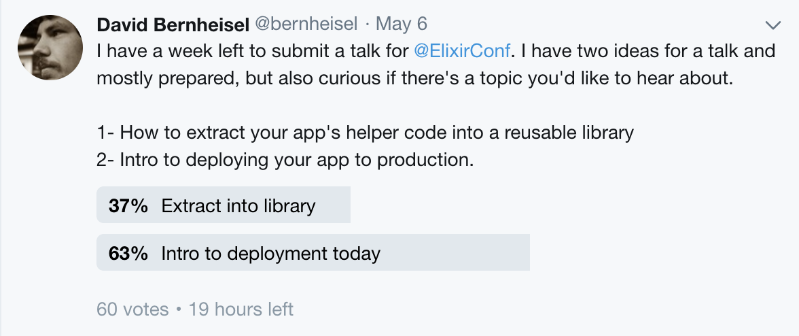

# Deploying to Production Today

David Bernheisel @bernheisel

Viget Labs, LLC

Note: There are too many options for how to deploy an Elixir web app. With old
ways and new ways, old tools and new tools, and SaaS products that let
you ignore important features of the language, it's difficult for new
developers to write an app and feel good about how to introduce it to
the world.

Even though Elixir is relatively new to market, we face tool fatigue too
much already, so we're going to explore the popular options for
deploying Elixir web applications and boil the options down to two: (1)
easy, and (2) better.

<!--s-->

# Disclaimer
- Details may change in Elixir 1.7 <!-- .element: class="fragment" data-fragment-index="1" -->
- Some details may not matter depending on the strategy you choose <!-- .element: class="fragment" data-fragment-index="2" -->
- Nothing new in this talk <!-- .element: class="fragment" data-fragment-index="3" -->
- If you want something new, bitwalker <!-- .element: class="fragment" data-fragment-index="4" -->
- José is proposing Application.config (undetermined) <!-- .element: class="fragment" data-fragment-index="5" -->

<!--s-->

<!-- .slide: style="margin-top: -30%" data-background="./images/deployment_today/too-many-options.gif" -->

Note: Too many options

<!--s-->

## Too Many Options

||
---|---
 Containers? | Distillery
 Exrm        | Gatling
 Gigalixir   | Heroku
 Nanobox     | akd
 bootleg     | bottler
 eDeliver    | exdm
 exreleasy   | relx
 `git pull && mix run --no-halt`

Note: There are too many options out there. This table shows the options
that I could easily find; mostly pulled from the Awesome Elixir list.
Please god let no project just ssh into a server and run mix run no
halt.

What this table reveals is a couple of problems, good problems to have,
but problems nonetheless.

<!--s-->

# Evident Problems

- Too many different ways to deploy
- High chance of tool fatigue
- It's been changing
- Old and new ways
- No wrongest or rightest way
- My goal is to boil it down to 2 options for _your_ project.

Note: These are great problems to have. There's no way that I could
discern in an evening which tool is best for my project. All of this at
once is paralyzing. Do you remember the first time you were learning
VIM, or emacs, or your GUI editor? It's exhausting.

The tools have been changing. Not all of these tools were eDeliver once
used exrm as its underlying release tool, then Distillery. New tools
have been released.

<!--s-->



<!--s-->

# WHEN

<!--s-->

## Immediately

- Deployment option can change your code <!-- .element: class="fragment" data-fragment-index="1" -->
- Setting up the good practice <!-- .element: class="fragment" data-fragment-index="2" -->
- Lower your stress <!-- .element: class="fragment" data-fragment-index="3" -->

<!--s-->

<!-- .slide: style="margin-top: 25%" data-background="./images/deployment_today/after-action-review.gif" -->
When a developer has to explain his/her salary after a bad deploy

<!--s-->

## Deployment Is Like Code

- The longer you wait, the more stressed you'll be
- The bigger the change, the more area surface area to debug
- Once established, you save your co-workers tool fatigue

Note: Make the deployment process established earlier, so it's no big
deal to deploy. Make it EASY, even if the process is hard.

<!--s-->

# How to Decide

### Size
1. Personal
1. Business <!-- .element: class="fragment" data-fragment-index="1" -->
1. Enterprise <!-- .element: class="fragment" data-fragment-index="2" -->

<!--s-->

# How to decide

### Resources
- Do you want to do it yourself?
- Do you have someone on your team that can do it? <!-- .element: class="fragment" data-fragment-index="1" -->
- Should you pay someone else to do it? <!-- .element: class="fragment" data-fragment-index="2" -->

Note: Not going to try to tell everyone what they should do; you know
your project the best. The difference is your interest and what
resources you have available.

This shouldn't come to anyone's surprise. It boils down to the value
prop of platforms out there.

<!--s-->

# Easy

<!--s-->

# SaaS

<!--s-->

<!-- .slide: style="margin-top: 25%" data-background="./images/deployment_today/what-1.jpg" -->

<!--s-->

<!-- .slide: style="margin-top: 25%" data-background="./images/deployment_today/what-2.gif" -->

<!--s-->

<!-- .slide: style="margin-top: 25%" data-background="./images/deployment_today/what-3.gif" -->

<!--s-->

<!-- .slide: style="margin-top: 25%" data-background="./images/deployment_today/what-4.jpg" -->

<!--s-->

<!-- .slide: style="margin-top: 25%" data-background="./images/deployment_today/what-5.png" -->

<!--s-->

<!-- .slide: style="margin-top: 25%" data-background="./images/deployment_today/what-6.gif" -->

<!--s-->

# Heroku | Gigalixir

<!--s-->

# Heroku

- Cheapest time cost
- Limited database connections
- Let's you ignore some compile-time vs run-time configuration
- Distributed clustering not available
- GenServers get reset
- Remote Observers/Shells not available.


Note: That's a lot to give up. You need to decide at this point if
that's worth it or not. If you're a small project, it's highly likely
that you don't need distributed clustering.

Heroku's remote shells aren't such a big deal, because you can run a
console on a new dyno. But, you do lose the ability to have a remote
observer. That kinda stinks.

The bad side of these 'cheats' is that you don't know how to do it 'the
elixir way'. Basically, it lets you make a Rails-like Elixir
application.

<!--s-->

<!-- .slide: style="margin-top: 25%" data-background="./images/deployment_today/no-like.png" -->

<!--s-->

# Gigalixir

- Cheapest time cost
- _**Severely**_ limited (free) database connections
- ~~Let's you ignore some compile-time vs run-time configuration~~
- ~~Distributed clustering not available~~
- ~~GenServers get reset~~
- ~~Remote Observers/Shells not available.~~

Note: But only one database connection. That totally sucks and
complicates the startup process. Also, the tools are finicky. I couldn't
install them on the latest patch version of Python 2.7. Also, the error
messages are ugly

It's an early service, but it's by someone who really cares about _this_
community, so it's worth some investment from the community. On the
other hand, it's not exactly a proven platform. If you don't have much
to risk, give Gigalixir a shot. Price-wise, they're comparable to
Heroku. I just wish their free option was a little less limiting on the
database side.

<!--s-->

<!-- .slide: style="margin-top: 25%" data-background="./images/deployment_today/like.gif" -->

<!--s-->

## Nuts and Bolts

- [if using Gigalixir] Add Distillery
- [if needed] Provision database
- Setup staging git remote
- Setup production git remote
- Let `git push` and buildpacks handle it
- Write a simple `bin/deploy` script to handle the push and run
    migrations or tasks

<!--s-->

## setup
```shell
$# edit prod.exs to System.get_env("DATABASE_URL")
$# edit prod.exs to have pool_size: 18
$ heroku addons:create heroku-postgresql:hobby-dev
$ heroku git:remote -a your-app-production -r production
$ heroku git:remote -a your-app-staging -r staging
$ heroku buildpacks:add ...heroku-buildpack-elixir.git
$ heroku buildpacks:add ...heroku-buildpack-phoenix-static.git
$ heroku config:set SECRET_KEY_BASE=$(mix phx.gen.secret)
$ git push staging
$ git push production
```

<!--s-->

## `bin/deploy production`

```bash
#!/bin/sh
# Run this script to deploy the app to Heroku.

# Exit script if anything returns as an error
set -e

branch="$(git symbolic-ref HEAD --short)"
target="${1:-staging}"

git push "$target" "$branch:master"
heroku maintenance:on --remote "$target"

if [ "$target" != "staging" ]; then
  heroku pg:backups:capture --remote "$target"
fi
```

<!--s-->

## `bin/deploy production`

```bash
#...
heroku run "POOL_SIZE=2 mix ecto.migrate" \
  --exit-code --remote "$target"

if [ "$target" = "staging" ]; then
  heroku run "POOL_SIZE=2 mix development_seeds" \
    --exit-code --remote "$target"
fi

heroku restart --remote "$target"
heroku maintenance:off --remote "$target"
```
<!--s-->

<!-- .slide: style="margin-top: 25%" data-background="./images/deployment_today/free-as-in-beer.png" -->

<!--s-->

https://hexdocs.pm/phoenix/heroku.html

<!--s-->

# Do not underestimate the value of DevOps

Note: There's a ton of other value props you get when using services
like Heroku. Load balancing; OS and database updates; reliability; DDOS
mitigation; marketplace; alerting

<!--s-->

<!-- .slide: style="margin-top: 25%" data-background="./images/deployment_today/swish.gif" -->

<!--s-->

# Better*

Note: The asterisk means that it's only better for some projects

<!--s-->

# Distillery*

Note: This is the part that could change with Elixir 1.7

<!--s-->

## Distillery + "Cloud"

- Expensive time cost
- Complete control
- Maximize efficiencies
- Cheapest resource cost

Note: With great power comes great responsibility

<!--s-->

<!-- .slide: style="margin-top: 25%" data-background-size="contain" data-background="./images/deployment_today/maximum-effort.png" -->

<!--s-->

<!-- .slide: style="margin-top: 25%" data-background-size="contain" data-background="./images/deployment_today/great-responsibility.jpg" -->

<!--s-->

### Why!?

- `mix run --no-halt` lazy loads modules
- Gives you a node for clustering
- `run_erl` (helps to manage the standard I/O of a program)
- `heart` (restart when crash, when pid terminates. Disabled by default)


Note: With great power comes great responsibility. All the
responsibility is yours. The reason why we strive for compiled releases
is because using mix in production can result in high latency on some
functions because mix needs to load those modules and dependencies.

Also, in the time that you need to scale up and cluster, you won't want
to battle getting off of Mix.


<!--s-->

## Nuts and Bolts

- Setup project with Distillery.
- Spin up a DigitalOcean droplet
- Setup the server
- Setup the database
- SSL is a thing (that I'm ignoring tonight)
- Setup a matching Dockerfile for local compile
- Write a `bin/release` script to copy the release binary and restart the
    prod app

<!--s-->

# Add Distillery

```elixir
defp deps do
  [{:distillery, "~> 1.5", runtime: false}]
end
```

```shell
mix release.init
```

Copy/paste `ReleaseTasks` module from Distillery readme to assist with
migrations

<!--s-->

# Setup Server

Create user

```shell
## ssh root@your_server
#> adduser deploy sudo
#> usermod -aG sudo deploy
#> find .ssh -print | cpio -pdmv --owner=deploy ~deploy
#> sudo su - deploy
$> mkdir your_app
```

Copy secrets over

```bash
# ~/.bashrc
export DB_USER=deploy
export DB_PASS=shh
export HOST=localhost
export SECRET_KEY_BASE=1234
export REPLACE_OS_VARS=true
export PORT=4000
```

<!--s-->

Distillery can replace strings on startup like:
```elixir
"${DB_USER}"
```

with something like:

```elixir
"deploy"
```

when you run the app like:

```shell
$ export DB_USER=deploy
$ REPLACE_OS_VARS=true ./bin/your_app
```

NO MORE OF THIS

```elixir
{:system, "PORT"}
```

<!--s-->

- Mix tasks aren't available in production
  - ~~mix ecto.create~~
  - ~~mix ecto.seed~~
  - ~~mix run yo_thang~~
<!--s-->

<!-- .slide: style="margin-top: 25%" data-background="./images/deployment_today/swish.gif" -->

<!--s-->

# HTTP server

```shell
$ sudo apt-get install nginx
$ sudo vim /etc/nginx/sites-available/your_app
$ # paste some stuff
$ sudo ln -s /etc/nginx/sites-available/your_app \
    /etc/nginx/sites-enabled/your_app
$ sudo rm /etc/nginx/sites-enabled/default
$ sudo systemctl restart nginx
```

<!--s-->

<!-- .slide: style="margin-top: 25%" data-background-size="contain" data-background="./images/deployment_today/copy-paste-pro.png" -->

<!--s-->

## nginx

```nginx
upstream phoenix {
  server localhost:4000 max_fails=5 fail_timeout=60s;
}

map $http_upgrade $connection_upgrade {
  default upgrade;
  '' close;
}

server {
  server_name <app-domain>;
  listen 80;
  listen [::]:80;
  ...
  ```

<!--s-->

## nginx

```nginx
...

  location / {
    allow all;
    proxy_http_version 1.1;
    proxy_set_header X-Forwarded-For $proxy_add_x_forwarded_for;
    proxy_set_header Host $http_host;
    proxy_set_header X-Cluster-Client-Ip $remote_addr;
    proxy_set_header Upgrade $http_upgrade;
    proxy_set_header Connection "upgrade";
    proxy_pass http://phoenix;
    proxy_redirect off;
  }
}
```

Note: There are ways to validate your nginx config. That's a good idea.
Don't forget about the map so websocket requests can upgrade

<!--s-->

# Systemd Unit

<!--s-->

<!-- .slide: style="margin-top: 25%" data-background-size="contain" data-background="./images/deployment_today/herding-cats.gif" -->

<!--s-->

`/etc/systemd/system/your_app.service`

```toml
[Unit]
Description=YourElixirApp
After=network.target

[Service]
Type=simple
User=deploy
Group=deploy
WorkingDirectory=/home/deploy/your_app
ExecStart=/home/deploy/your_app/bin/your_app foreground
ExecStop=/home/deploy/your_app/bin/your_app stop

#...
```

<!--s-->

`/etc/systemd/system/your_app.service`

```toml
Restart=on-failure
RestartSec=5
SyslogIdentifier=your_app
RemainAfterExit=no

[Install]
WantedBy=multi-user.target
```

```shell
$ sudo systemctl enable your_app
```

<!--s-->

<!-- .slide: style="margin-top: 25%" data-background-size="contain" data-background="./images/deployment_today/too-much-already.jpg" -->

<!--s-->

<!-- .slide: style="margin-top: 25%" data-background="./images/deployment_today/swish.gif" -->

<!--s-->

## Nuts and Bolts

- Setup project with Distillery. ✅
- Spin up a DigitalOcean droplet ✅
- Setup the server ✅
- Setup the database ⬅️
- SSL is a thing (that I'm ignoring tonight) 🤙
- Setup a matching Dockerfile for local compile
- Write a `bin/release` script to copy the release binary and restart the
    prod app

<!--s-->

# POSTGRESQL

<!--s-->

## CREATE DATABASE

```shell
$ sudo apt-get install postgresql postgresql-contrib
$ sudo su - postgres
$ createdb your_app
$ psql
```

```sql
CREATE ROLE deploy WITH superuser;
ALTER ROLE deploy WITH createdb;
ALTER ROLE deploy WITH login;
ALTER USER deploy WITH PASSWORD 'shh';
```

<!--s-->

<!-- .slide: style="margin-top: 25%" data-background="./images/deployment_today/lets-go-deeper.png" -->

<!--s-->

# Dockerfile

<!--s-->

## Dockerfile

```dockerfile
FROM ubuntu:18.04
MAINTAINER YourTiredButt <you@istired.com>

## Setup Environment
WORKDIR /app
RUN apt-get update && apt-get install -y \
  curl locales aptitude git wget build-essential automake \
  autoconf m4
RUN locale-gen en_US.UTF-8
ENV LANG=en_US.UTF-8
ENV LANGUAGE=en_US:en
ENV LC_ALL=en_US.UTF-8
ENV TERM=linux
```

<!--s-->

## Dockerfile

```dockerfile
## Install language and its dependencies

# OPTION 1: Use asdf for all version management.
# Benefit: One place (.tool-versions) to manage versions
# Drawback: It's slower
RUN apt-get update
RUN apt-get install -y \
  libreadline-dev libyaml-dev libncurses5-dev ca-certificates \
  libssh-dev libxslt-dev xsltproc libxml2-utils libffi-dev \
  libtool unzip \
  default-jdk unixodbc-dev fop \
  libwxgtk3.0-dev libgl1-mesa-dev libglu1-mesa-dev
```

<!--s-->

## Dockerfile

```dockerfile
# OPTION 2: Install versions directly. Comment out if you
# want asdf to install versions.
# Benefit: It's faster
# Drawback: Two places to manage versions
RUN wget https://packages.erlang-solutions.com/erlang-solutions_1.0_all.deb && \
  dpkg -i erlang-solutions_1.0_all.deb && \
  apt-get update && \
  apt-get install -y \
    esl-erlang=1:20.3 \
    elixir=1:1.6.4
```

<!--s-->

## Dockerfile

```dockerfile
## Install asdf
# bin/setup will use asdf to install versions, but won't
# try if they're already installed.
RUN git clone https://github.com/asdf-vm/asdf.git /asdf
RUN echo '. /asdf/asdf.sh' >> /etc/bash.bashrc
ENV PATH /asdf/bin:/asdf/shims:$PATH
ENV NODEJS_CHECK_SIGNATURES=no
# Don't let this ^ be you
RUN asdf plugin-add erlang && \
    asdf plugin-add elixir && \
    asdf plugin-add nodejs
```

<!--s-->

## Dockerfile

```dockerfile
# Build dependencies
RUN apt-get install -y \
  python

# Build app
ENV MIX_ENV prod
COPY . /app
RUN ./bin/setup
```

```dockerfile
# .dockerignore
assets/node_modules
priv/static
_build
```

<!--s-->

<!-- .slide: style="margin-top: 25%" data-background-size="contain" data-background="./images/deployment_today/too-much.jpg" -->

<!--s-->

# BUILD SCRIPT

```bash
# bin/setup
#!/bin/sh
set -e

echo "Installing dependencies and compiling"
mix local.hex --force
mix local.rebar --force
mix deps.get
mix compile
. bin/setup-assets.sh
```

Note: This is a good script to have around anyway for other developers
wanting to be productive fast on your project.

<!--s-->

# BUILD SCRIPT

```bash
# bin/setup-assets.sh
#!/bin/sh
set -e

echo "Installing NPM dependencies"
PROJECT_ROOT=$(pwd)
cd assets
rm -rf node_modules
npm install --progress=false
cd "$PROJECT_ROOT"
```

<!--s-->

```yml
# docker-compose.yml
version: '3'
services:
  builder:
    build: .
    command: bash bin/build-release.sh
    volumes:
      - ./_build/prod/rel:/app/_build/prod/rel
```

<!--s-->

# BUILD RELEASE SCRIPT

```bash
# /bin/build-release.sh
#!/bin/bash
set -e

PROJECT_ROOT=$(pwd)
cd assets
./node_modules/brunch/bin/brunch build --production
cd "$PROJECT_ROOT"

mix phoenix.digest
mix release --env prod --verbose
```

<!--s-->

<!-- .slide: style="margin-top: 25%" data-background-size="contain" data-background="./images/deployment_today/be-this.png" -->

<!--s-->

<!-- .slide: style="margin-top: 25%" data-background-size="contain" data-background="./images/deployment_today/not-this.png" -->

<!--s-->

<!-- .slide: style="margin-top: 25%" data-background="./images/deployment_today/swish.gif" -->

<!--s-->

## Nuts and Bolts

- Setup project with Distillery. ✅
- Spin up a DigitalOcean droplet ✅
- Setup the server ✅
- Setup the database ✅
- SSL is a thing (that I'm ignoring tonight) 🤙
- Setup a matching Dockerfile for local compile ✅
- Write a `bin/release` script to copy the release binary and restart the
    prod app ⬅️

<!--s-->

# Almost there!!

<!--s-->

# RELEASE IT

```bash
# bin/release.sh
#!/bin/sh
PROD=204.48.29.223
SSH_USER=deploy
VERSION="0.0.1"
APP=exgradebook

docker-compose up --build

echo "Uploading release"
scp _build/prod/rel/$APP/releases/$VERSION/$APP.tar.gz \
  $SSH_USER@$PROD:~/$APP
# ...
```

<!--s-->

# RELEASE IT

```bash
# ...

echo "Restarting the app on production"
ssh $SSH_USER@$PROD /bin/bash << EOF
  cd $APP
  tar -xzf $APP.tar.gz
  sudo systemctl restart $APP
  REPLACE_OS_VARS=true ./bin/$APP migrate
EOF
```

<!--s-->

# FINALLY

<!--s-->

`bin/release.sh`

<!--s-->

<!-- .slide: style="margin-top: -30%" data-autoplay data-background-iframe="https://www.youtube.com/embed/7gBii44aRHk" -->

<!--s-->

<!-- .slide: style="margin-top: -30%" data-background-iframe="http://204.48.29.223/staff/login" -->

<!--s-->

<!-- .slide: style="margin-top: 25%" data-background-size="contain" data-background="./images/deployment_today/high-five.gif" -->

<!--s-->

## If you have even more time:
- Separate the database
- Don't forget to regularly backup the database
- Git hooks
- Ansible script
- CDN Strategy
- Kubernetes for scaling
- You know... all the stuff that SaaS does
-
<!--s-->

<!-- .slide: style="margin-top: 25%" data-background-size="contain" data-background="./images/deployment_today/let-the-devops-flow.jpg" -->


<!--s-->

# Good problems

- People are experimenting
- Experimenting out loud gives everyone the chance to learn
- Elixir community is _large enough to give newbies fatigue_
- There will be a _common_ way soon, hopefully.

Note: I won't say that Elixir 1.7 introduces the _right_ way to deploy,
but only that it'll give mix the tools to that'll let the community
consolidate to a common pathway.

<!--s-->

<!-- .slide: style="margin-top: 25%" data-background-size="contain" data-background="./images/deployment_today/last-slide.png" -->
