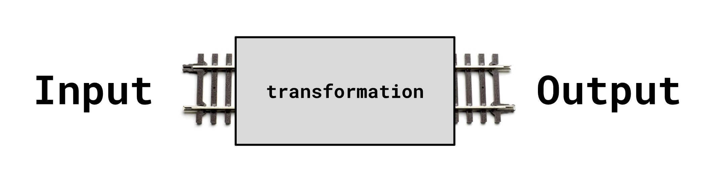

footer: @bernheisel --- WHY ELIXIR?
theme: Titillium (Better Code)
slidenumbers: true

# [fit] Why I
# [fit] Enjoy
# [fit] Elixir

---

# [fit] developer
# [fit] perspective

---

# [fit] Monolith

^ First we started with monoliths, but then we got tired of how
difficult it was for objects to not mess with each other. Following
those SOLID principles is pretty hard, especially with a diverse team of
varying experience.

---

Objects managing their own state


^ We realized that if all the objects share the same space, they begin
to interfere with one another. It turns out it's very difficult for any
one developer to know how the entire system works, remember all the edge
cases, and know with certainty that the contracts we tried to write are
enforced.

---

# [fit] Microservices

^ So we replaced monoliths with microservices because we felt that
outages could feel more like a murder mystery and our devops friends
could get paid more.

---


^ Microservices allowed us to draw harder lines between our solutions.
It brings a couple of cool benefits, like being able to scale services
separately, deploy them separately, track them seperately, report errors
on them separately, make sure all of them have heartbeats, separate
their git history, manage several readmes, rensure the dependency graph
makes sense, oh my gosh there so many devops things to do with
microservices. I was hired to write software, right? Not babysit
software.

---

# [fit] Maintainable
# [fit] Extendable
# [fit] Enjoyable

^ I want manageable applications in any language, and I have found that
easiest to with Elixir. Honestly don't care if that means a lot of small
applications, a set of medium applications, or a large application.

^ For monoliths, I've discovered that it's difficult to extend, because
it's hard to know what the interference may be. Yes, I can just code it,
run the tests and see what happens, but production and end-users might
not respect the tests that I forgot to write.

^ On a personal level, I've realized that I don't really enjoy devops.
Yes I can do it, but it's not for me. Tweaking nginx, haproxy, firewall
rules, and virtual networks are not details that I want to carea about;
and it seems that the need for me to care is shrinking with large
solutions like AWS, Heroku, DigitalOcean, and so forth. In my head,
orchestrating microservices is not what I want.

^ I want to enjoy extending or maintaining software.

---

# What makes software enjoyable to work on?

* Tooling
* Debugging
* Limited WTF moments
* Readability
* Micropatterns

[.build-lists: true]

^ Tooling is a big deal, and we're getting better at it all the time.
React, Vue, Ruby all have incredible tools that makes setting up and
managing projects pretty easy. That makes it enjoyable for us because we
avoid setup-hell.

^ Debugging isn't enjoyable in itself, but bugs are inevitable, and
being able to reproduce, pry into the code, setup breakpoints, see it in
the browser if needed are essential.

^ Limiting the amount of WTFs is always a good thing. There's always
going to be a small amount of these, but when it's a small amount they
seem to be 'challenges' more than 'frustration'. When there's a ton of
WTF moments, it reveals that lessons you learned were false, or that the
language is lying to you. That's not enjoyable.

^ Reading code is what we do every day as software developers. We have
to read our own, our own from 10 years ago, our co-workers, random
folks' on the internet. We all at least know our primary language, and
development is a second, third, or forth, so we have in our brains a
translation later. Some programming languages are so foreign to us, that
it breaks our ability to translate into our natural language. If we
can't read it, we therefore can't communicate with it, and so we resort
to SPEAKING LOUDER or USING HAND MOTIONS to communicate, which
unfortunately doesn't work yet with computers.

---


# !CLEVER

^ If I review someone else's code and see a clever method, I usually
find it because I had to read that code several times to understand it.

^ It's not because I'm dumb; it's not because they're a genius; it's
because they used an edge-case in the language to accomplish their goal
at the cost of revealing their intention. They spoke in unnatural
language or a different dialect. Problem is, we're supposed to be able
to speak the same language. It's not as understandable. The code doesn't
read like a story that I'm able to relate with quickly.

^ Clever code is not saving anyone time. It's wasting mine, probably
yours, and definitely your future self's when you realize you can't read
whatever bullshit you just wrote.


---

# [fit] Micropatterns

^ Lastly, and most important in this talk, is micropatterns.
Micropatterns are those small patterns that might be imperceptable, but
give you that "good feeling" when you see them. They're recognized,
they're predictable, they're familiar. It's like seeing good friends,
good friends that understand me. Because really, what we want in our
core human selves is to be understood.

---

# [fit] UNDERSTOOD

^ I want to be the most understood person in the room. I want anyone
that looks at my code to be able to understand it and extend it.

---

# [fit] ELIXIR

^ So, let's talk about Elixir. Elixir is a language introduced about 7
years ago in 2011. It's a higher-level language that tricks you into
thinking you're writing Ruby. It was developed by a person named Jose
Valim who was big in the Ruby community and was struggling to make Ruby
work well with concurrency. He decided to instead leverage Erlang's
platform, but found writing Erlang too obtuse. Introducing Elixir.

^ It compiles down to Erlang bytecode. What is Erlang?

^ Erlang is a 32 year old language originally developed for making the
telephone systems stable and without downtime. The BEAM Virtual Machine
compiles it to C and is extremely fast.

^ Elixir is a functional language that takes advantage of all the system
resources. It's not just a language though, because it's built on top of
Erlang which provides a mini OS called OTP. We won't explore that today,
but just know that it is quite unique in the set of tools it provides
developers. A sneak peak: it comes with an HTTP server, FTP server, SSH
serer, database, and more.

---

## Micropatterns

* Pipelines
* Composition
* Totality
* Monads
* Happy path

^ There are some prominent micropatterns in Elixir that make it a
pleasure to use.

---

### Pipelines

```elixir
def load(filename)
  filename
  |> read()
  |> parse()
  |> validate()
end

# validate(parse(read(filename)))
```

^ Pipelines present a clear path of input and output, and what is
happening at every train stop. It reveals the transformation of data
very clearly. The operator that you see here, the sideways triangle is
just a pipe and right-angle. It's taking the expression or variable
above it and passing it into the first argument of the next function.

The second line is pretty hard to follow, so the pipe operator makes it
easy to see the line of transformation.

---

[.background-color: #FFFFFF]



^ The big thing here is that everything is very predictable. You always
have an input, and you always get output.

---

[.background-color: #FFFFFF]


^ The input comes in as one form, a transformation happens, and then you
have an expected output

---


^ It's simple, and very effective. The operator itself helps with
readability a lot, and using it encourages developers to structure their
functions to work well with pipes.

^ If we think about how computers work, we think in terms of lines.
These lines carry electrical pulses that pulse in predictable patterns.
These pulses turn into 1's and 0's, which in turn turn into words, which
form instructions, which perform actions for us as instructed. These all
happen linearly.

^ The data that is pulsed happens in a pipeline at several levels. I
just illustrated the smallest level, but as Wreck-It Ralph is
illustrating, it is the same pattern as we get larger. Data is passed
through pipelines, which connect with other pipelines, with collectively
give us cool things like GUIs, the internet, and wifi.

---

### Pipelines

```elixir
def load(filename)
  filename
  |> read_file()
  |> parse()
  |> validate()
end
```

^ Back to our program, this pipeline is readable and simply reads like
this: "take this filename, open the file and read it, parse the file
, and validate the file data."

^ It's a system of functions working together, and we stitch these
functions together to make longer pipes of data, and these pipes
constructed into other pipes, and so on. We've named this function 'load'

^ We can trust this pipeline because we believe in another micropattern
called Totality

---

### Totality

```elixir
@spec load(String.t) :: [Row.t]
def load(filename), do: [%Row{id: 1}, ...]
```

```elixir
@spec read(String.t) :: Enumerable.t
def read(filename) do
  case filename do
    nil ->
      raise FileError, "Filename not supplied"
    filename ->
      filename |> read_file!
  end
end
```

^ Totality is the pattern that your function does not lie to you or
surprise you with an unexpected result.

^ Defining types in Elixir is optional, but when you have it, it serves
as documentation to other developers, and it indicates what kind of
input and output you should expect.

^ There is tooling available to check if you're honoring your typespecs
at compile-time. In this example, the specs above each function tells
us what to expect.

^ The first function is simple. It says it takes in a string, and it
returns a list of rows. This function is contrived, but just looking at
it, you'll see that there's absolutely no way for it to surprise you.
You give it a string, and it always gives you a list of rows.

^ The second function is not total because it has the option to raise an
exception. It's not a total function. I'm supposed to always get an
Enumerable. BTW, Please don't do this, it's awful and performance-wise
is never better. As a developer, I don't need you to decide for me to
raise an exception in my application, I need you to be a monad. Let's
rewrite it a bit.

---

### Monad

```elixir
@spec read(String.t) :: {:ok | :error, Enumerable.t}
def read(filename) do
  case filename do
    nil ->
      {:error, "Filename not supplied"}
    filename ->
      {:ok, read_file!(filename)}
    end
  end
end
```

^ This first function is a monad. The difference here that makes it a
monad is that it gives you metadata about the function's result. It's
either one of these things: something, or nothing. In this case, I'm
returning a tuple that allows me to switch upon it in the pipeline. The
first element in the tuple is either an :ok atom, or an :error atom.

^ Going back to the railway metaphor, let's see how monads can help us
construct pipelines.

---

Show railway images with branches

---

### Happy Path

```elixir
@spec parse({:ok | :error, Enumerable.t}) :: {:ok | :error, Enumerable.t}
def parse({:ok, raw_rows}) do   # Happy Path :)
  parsed_rows =
    Enum.map(raw_rows, fn raw_row ->
      %Row{
        name: raw_row[0],
        email: raw_row[1],
      }
    end
  {:ok, parsed_rows}
end
def parse(errors), do: errors   # Unhappy Path :(
```

^ It's easy to program for the happy path when the language includes
pattern-matching. With pattern-matching, I can easily identify what I
need from the input so I can transform the data and return it as the
output. I usually do this first because it's the first thing that's on
my mind, "How do I make this work?"

^ It's also easy to recognize that I have limited my happy path in the
clause, and it's equally as easy to include an unhappy path clause right
after it. In this case, _only_ in the case of an {:ok} tuple will it
proceed to transform; otherwise, the other clause will match and simply
pass on the data as-is with no transformation.

^ Programming for the unhappy path is more difficult in other languages
without pattern-matching. It's more difficult because it's easier to
forget. A big example of what we forget to handle is Nil

---

# [fit] Nil
# [fit] NoMethodError

---

### Composition

```elixir
@spec read(String.t) :: {:ok | :error, Enumerable.t}
def read(nil), do: {:error, "Filename not supplied"}
def read(filename) do
  {:ok, read_file!(filename)}
end
```

^ Let's go back to an earlier code sample. Here we turned our function
into a monad, and leveraged pattern-matching to recognize our happy
path.  In the happy path, notice that I'm simply calling another
function.

^ That's it. That's composition. Let's look at `read_file!/1`

---

### Composition

```elixir
@spec read_file!(String.t) :: Enumerable.t
def read_file!(filename) do
  filename
  |> File.stream!
  |> CSV.decode!
end
```

^ Well look at that; it's just another function that calls other
functions.

---

### Composition

> OOP has objects in the large, and methods in the small
> FP has functions in the large, and functions in the small

-- Scott Wlaschin (Functional Programming Design Patterns)

^ This pattern happens everywhere because functional programming is
consistent. Every problem is solved with a function. You don't have to
shift paradigms in how to solve a problem depending on its scale.

---

### Composition

```elixir
response =
  request
  |> router()
  |> controller()
  |> view()
```

---

### Functions all the way down


---

^ I've been priming you for the big reveal.

---

# [fit] NOT
# [fit] MICRO

---

> That's how Plug works
> That's how Phoenix works
> That's how Ecto works
> That's how Absinthe works
> That's how Hex works
> That's how everything works

---

# [fit] UNDERSTOOD

^ The goal is to be understood. I can understand the code in libraries
if they're using similar patterns to me. I can extend libraries if all I
have to do is lay down more railroad tracks.

^ I can change out functionality by replacing a track of railway since
everything is just a set of inputs and outputs.

^ It's consistent.

---

---
| Object Oriented       | Functional         |
|-----------------------|--------------------|
| Single Responsibility | functions          |
| Open/Closed           | fn                 |
| Liskov substitution   | functions, also    |
| Interface Segregation | functions, still   |
| Dependency Inversion  | objects...jk. fn   |
| Factory pattern       | still functions    |
| Decorator pattern     | fun                |
| Visitor pattern       | FUNCTIONS          |

---

# [fit] Elixir has
# [fit] excellent
# [fit] patterns

---

# [fit] Maintainable
# [fit] Extendable
# [fit] Elixir

---

# [fit] @bernheisel
# [fit] Viget Labs

Sources:
[Cameron Price: Micropatterns](https://www.youtube.com/watch?v=9uvp4h7gXHg)
[Scott Wlaschin: Functional Programming Design Patterns](https://www.youtube.com/watch?v=srQt1NAHYC0)
