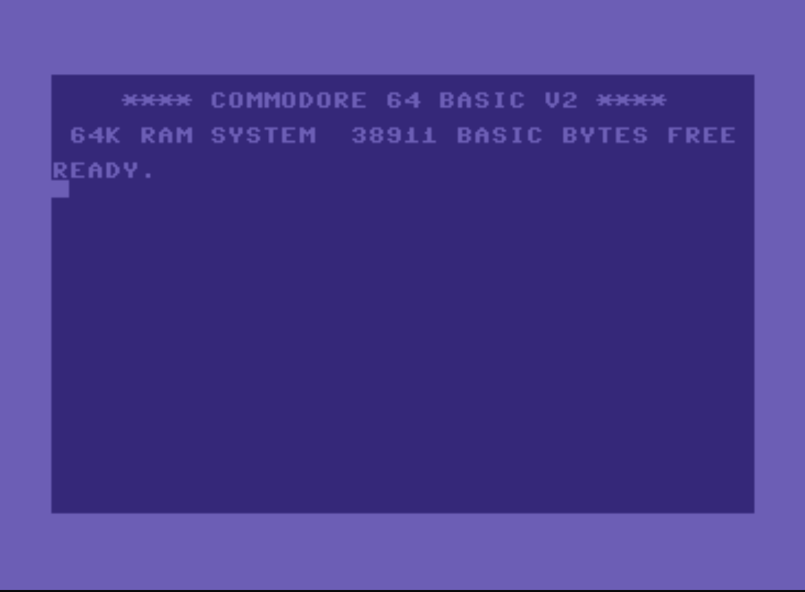
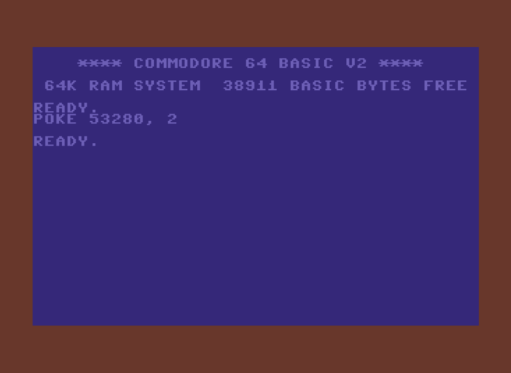
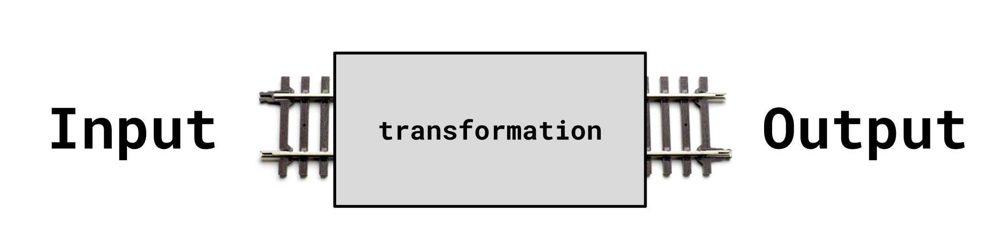
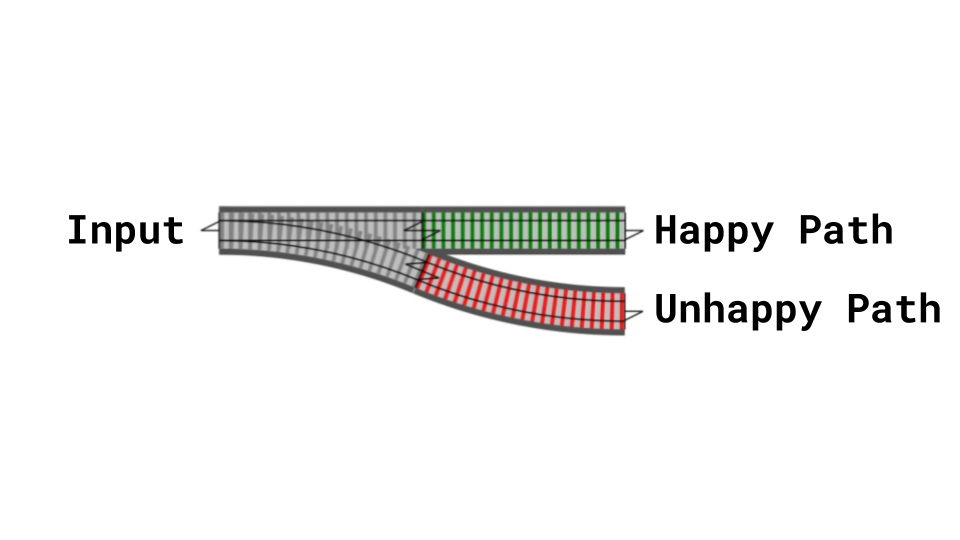

footer: @bernheisel --- WHY ELIXIR?
theme: Titillium (Better Code)
slidenumbers: true

# [fit] Why I
# [fit] Enjoy
# [fit] Elixir

---

# [fit] developer
# [fit] perspective

---

# [fit] dissatisfaction

---



^ Let's talk about Commodore 64. This 1982 ancient beauty ran BASIC as
it's terminal. It was great. It cost $1500 in today dollars when it launched and sported 16 colors and a whopping 64KB RAM, with 20KB available to the user. Can you imagine a computer whose primary user interface was the REPL? Power button -> Boot -> IRB

^ At that time, 36 years ago, the developers hadn't learned the lessons that we know today; their operating system allowed programs to share the same memory with things like the kernel. Isolation wasn't appreciated yet. You could exploit that and do nifty things, like push random values into a memory addresses.

^ Let's push the number 2 into memory address 53280 and see what happens.

---



^ That's nifty, people could change the border of their terminal from purple to brown. This way of developing didn't stop in 1982 though. It still happens today quite successfully. We have languages like C where you do need to manage the memory your application uses.

^ Great, right? Turns out, developers at-large aren't that great at this. When you let developers manage their own memory, bad things happen like memory leaks and slowing applications.

^ So what did we do? We created newer languages that would abstract that away and hide it. In the mid-90s, we saw languages like Ruby and Python show up. Nothing really happened until Rails came to the scene in 2004, 14 years ago. That's where we learned to make monolith applications

---

# [fit] Monolith

^ By this point, we've learned to isolate programs and not allow them to interfere with each other so much. But, that didn't stop developers from not isolating their program from itself.

^ You see, the application becomes so large, hence the name monolith, that developers forget that objects share the same ObjectSpace, just like the Commodore64 shared the same 20KB with other programs. Let's see a monolith application's objects manage themselves when you toss a bug in there.

---

Objects managing their own state


^ We realized that if all the objects share the same space, they begin to interfere with one another. It turns out it's very difficult for any one developer to know how the entire application works, and remember all the edge cases, and have certainty that the contracts we wrote are enforced. When a bug happens, it indeed is the darkest timeline.

---

# [fit] Microservices

^ So we replaced monoliths with microservices. Microservices allowed us to draw harder lines between our solutions. It brings a couple of cool benefits, like being able to scale services separately, deploy them separately, track them seperately, report errors on them separately, make sure all of them have heartbeats, manage their git repos separately, manage several readmes, ensure the dependency graph makes sense, oh my gosh there so many devops things to do with microservices.

^ Turns out, when bugs appear in microservices, it feels more like you're playing Clue, trying to find out which microservice murdered the application.

---


^ Some folks love microservices so much they want to orchestrate a symphony of them with software like Kubernetes. This is pretty cool when it comes to extending software, because you always feel like you're greenfielding an app. Microservices provide a constant green field for features, and allows space for new ideas. But, it comes with tradeoffs.

^ That tradeoff for me is that I don't personally enjoy devops. Some folks do. I don't. It feels like plumbing a house several times. It's dirty work that very few folks appreciate, and sometimes you have to wonder when the plumbing is done for an application.

^ So what do software developers really want?

---

# [fit] Maintainable
# [fit] Extendable
# [fit] Enjoyable

^ I want manageable applications in any language and honestly don't care if that means a lot of small applications, a set of medium applications, or one large application. I have found that easiest to do with Elixir

^ For monoliths, I've discovered that it's difficult to extend, because it's hard to know what the interference may be. The ObjectSpace is unforgiving.

^ For microservices, I find that it puts a lot more focus on plumbing an application, rather than the solution the application provides. Plus, services like Digital Ocean, AWS, Heroku, and more are providing great solutions today that abstract these problems away from me.

---

# What makes software enjoyable to work on?
[.build-lists: true]

* Tooling
* Limited WTF moments
* Community
* Readability
> "No man is an island entire of itself; every man is a piece of the continent, a part of the main" -- John Donne (1572)

^ Tooling is a big deal, and we're getting better at it all the time.  React, Vue, Ruby all have incredible tools that makes setting up and managing projects pretty easy. That makes it enjoyable for us because we avoid setup-hell. Also part of tooling is debugging. Debugging isn't enjoyable in itself, but bugs are inevitable, and being able to reproduce, pry into the code, setup breakpoints, see it in the browser if needed are essential. Good tooling means the language doesn't get in the way of your creating.

^ Limiting the amount of WTFs is always a good thing. There's always going to be a small amount of these, but when stays a small amount I find these to feel more like 'challenges' instead of 'frustration'. When there's a ton of WTF moments, it reveals that lessons you learned were false, or that the language is lying to you. That's not enjoyable. The understanding is wrong.

^ Speaking of WTF moments. WTF is up with eslint? WTF is up with leftpad?

^ Community is also a huge contributor to enjoying development. The excitement around a language; all the new ideas that are coming like GraphQL and WebAssembly that really have the potential to change the way we work. That comes out of community. Otherwise, what's the point of opensource without community? Unless you're a one-person shop, you need your coworkers. Community helps you improve understanding. It's documentation. Community is local and global. If no one is talking about it, neither will you without extraordinary willpower.

^ Reading code is what we do every day as software developers. We have to read our own code, our code from 10 years ago, our co-workers, random folks' on the internet. We all at least know our primary language, and development is a second, third, or forth, so we have in our brains a translation layer. Some programming languages are so foreign to us, that it breaks our ability to translate into our natural language. If we can't read it, we therefore can't communicate with it, and so we resort to SPEAKING LOUDER or USING HAND MOTIONS to communicate, which unfortunately doesn't work yet with computers.

^ Reading code is the primary way that we communicate in software, so it's incredibly important for the language itself to be expressive enough and easily able to translate to your primary language like English.

---

# [fit] Communication

^ All these traits lead to one thing: Communication. When you read good code, there's a feeling of relatedness.

---


# !CLEVER

^ Which is why it's important to not be clever with your code. We're not underground hackers with secret access to the depths of the virtual machine. The goal is not to make such complicated software that no one else but us can read it.

^ The goal isn't to master the language so much that you exploit some of its weirdness and have your coworkers suffer that.

^ The goal is to communicate with yourself and your co-workers about how you're solving this problem via code. We're not magical hackers saving time with our cleverness. Oftentimes our cleverness is wasting our future self's time and definitely our coworkers when they're reviewing code and debugging.
^ Clever code speaks in unnatural language or at least a different dialect. Problem is, we're supposed to be able to speak the same language. It's not as understandable. It's difficult to relate with quickly.

---

# What makes software enjoyable to work on?

* Tooling
* Limited WTF moments
* Readability
* Community
* Micropatterns

^ Lastly, and most important in this talk, is micropatterns.  Micropatterns are those small patterns that might be imperceptable, but give you that "good feeling" when you see them. They're recognized, they're predictable, they're familiar. It's like seeing good friends, good friends that understand me.

---

# [fit] Micropatterns


^ Or it could be very perceivable. It could definitely invoke nostalgia

---

# [fit] Micropatterns

^ Socially, we experience the same micropatterns everywhere. We have a routine in the morning with slight variations in traffic, but we know it. We listen to the same song several times and learn the patterns like the bass line, and notice the small deviations in new songs that become interesting.

^ Why does this matter? Because these patterns are recognizable. They comfortable. They're predictable. We get social anxiety when we're in a room full of people we don't know. It becomes noise, we can't find patterns early enough so we get frustrated and quit the scene, saying "These people don't understand me, and I don't understand them." Unrecognized patterns are no longer comfortable.

^ There is a huge win when you come to understand a new pattern, but it's large barrier to entry. When it's the language acting as a barrier, then you have 2 problems: the business problem, and the language problem.

---

# [fit] UNDERSTOOD

^ Back to code, these micropatterns are the common ways to understand and be understood which is a core need of a human. I want to be the most understood person in the room. That's what any sane person wants.

---

# [fit] ELIXIR

^ So, let's talk about Elixir. Elixir is a language introduced about 7 years ago in 2011. It's a higher-level language that tricks you into thinking you're writing Ruby. It was developed by a person named Jose Valim who was big in the Ruby community and was struggling to make Ruby work well with concurrency. He decided to instead leverage Erlang's platform, but found writing Erlang too obtuse. Introducing Elixir.

^ It compiles down to Erlang bytecode. What is Erlang?

^ Erlang is a 32 year old language originally developed for making the telephone systems stable and without downtime. Erlang code is compiled an interpreted through the BEAM Virtual Machine, which in turn is compiled to C and is extremely fast. Much like Java is to JVM, Erlang is to BEAM.

^ Elixir is a functional language that takes advantage of all the system resources. It's not just a language though, because it's built on top of Erlang which provides a mini operating system called OTP. We won't explore that today, but just know that it is quite unique in the set of tools it provides developers. A sneak peak: it comes with an HTTP server, FTP server, SSH server, a key-value database like Redis, and more. That's basically stdlib.

---

## Micropatterns

* Pipelines
* Totality
* Monads
* Happy path
* Composition

^ There are some prominent micropatterns in Elixir that make it a pleasure to use.

---

### Pipelines

```elixir
def load(filename)
  filename
  |> read_file()
  |> parse()
  |> validate()
end

# validate(parse(read(filename)))
```

^ Pipelines present a clear path of input and output, and what is happening at every train stop. It reveals the transformation of data very clearly. The operator that you see here, the sideways triangle is just a pipe and right-angle. It's taking the expression or variable above it and passing it into the first argument of the next function.

The second line is pretty hard to follow, so the pipe operator makes it
easy to see the line of transformation.

---

[.background-color: #FFFFFF]



^ The big thing here is that everything is very predictable. You always have an input, and you always get output.

---

[.background-color: #FFFFFF]


^ The input comes in as one form, a transformation happens, and then you have an expected output

^ It's simple, and very effective. The operator itself helps with readability a lot, and using it encourages developers to structure their functions to work well with pipes.

^ If we think about how computers work, we think in terms of lines. These lines carry electrical pulses that pulse in predictable patterns. These pulses turn into 1's and 0's, which turn into words, which form instructions, which perform actions for us. These all happen linearly.

---


^ These pipelines are connected to each other end-to-end, and deliver data to us and start to form the things we know of today, like wifi, GUIs, the internet, your phone. Data is passed through pipelines.

---

### Pipelines

```elixir
def load(filename)
  filename
  |> read_file()
  |> parse()
  |> validate()
end
```

^ Back to our program, this pipeline is readable and simply reads like this: "take this filename, open the file and read it, parse the file , and validate the file data." We've named this function 'load'

^ We can trust this pipeline because we believe in another micropattern called Totality

---

### Totality

```elixir
@spec load(String.t) :: [Row.t]
def load(filename), do: [%Row{id: 1}, ...]
```

```elixir
@spec read(String.t) :: Enumerable.t
def read(filename) do
  case filename do
    nil ->
      raise FileError, "Filename not supplied"
    filename ->
      filename |> read_file!
  end
end
```

^ Totality is the pattern that your function does not lie to you or surprise you with an unexpected result.

^ Defining types in Elixir is optional, but when you have it, it serves as documentation to other developers, and it indicates what kind of input and output you should expect.

^ There is tooling available to check if you're honoring your typespecs at compile-time. In this example, the specs above each function tells us what to expect.

^ The first function is simple. It says it takes in a string, and it returns a list of rows. This function is contrived, but just looking at it, you'll see that there's absolutely no way for it to surprise you. You give it a string, and it always gives you a list of rows.

^ The second function is not total because it has the option to raise an exception. It's not a total function. I'm supposed to always get an Enumerable. BTW, Please don't do this, it's awful and performance-wise is never better. As a developer, I don't need you to decide for me to raise an exception in my application, I need you to be a monad. Let's rewrite it a bit.

---

### Monad

```elixir
@spec read(String.t) :: {:ok | :error, Enumerable.t}
def read(filename) do
  case filename do
    nil ->
      {:error, ["Filename not supplied"]}
    filename ->
      {:ok, read_file!(filename)}
    end
  end
end
```

^ This first function is a monad. The difference here that makes it a monad is that it gives you metadata about the function's result. It's either one of these things: something, or nothing. In this case, I'm returning a tuple that allows me to switch upon it in the pipeline. The first element in the tuple is either an `:ok` atom, or an `:error` atom.

---



^ Going back to the railway metaphor, let's see how monads can help us construct pipelines.

^ At this point, I've split the possible directions of the data into two directions: a happy path, and an unhappy path.

---

### Allowing an Unhappy Path

```elixir
@spec parse({:ok | :error, Enumerable.t}) :: {:ok | :error, Enumerable.t}
def parse({:ok, raw_rows}) do   # Happy Path :)
  parsed_rows =
    Enum.map raw_rows, fn raw_row ->
      %Row{
        name: raw_row[0],
        email: raw_row[1],
      }
    end
  {:ok, parsed_rows}
end
def parse(errors), do: errors   # Unhappy Path :(
```

^ Pattern matching is a wonderful feature of a language, like Elixir, that enables developers to program for the happy obviously, and remind them there are unhappy paths. What's happening here is that when the data is passed into the function, the function will match against the values coming in, and execute the appropriate function body that matches the clause. For example, in the first function clause, I'm requiring that the first item in the tuple is an `:ok` atom. The second item gets assigned to `raw_rows`.

^ It's easy to recognize that I have limited my happy path in the
clause, and it's equally as easy to include an unhappy path clause right
after it. In this case, _only_ in the case of an `{:ok}` tuple will it
proceed to transform; otherwise, the other clause will match and simply
pass on the data as-is with no transformation.

^ It's easy to program for the unhappy path when the language includes
pattern-matching. With pattern-matching, I can easily identify what I
need from the input so I can transform the data and return it as the
output. I usually do this first because it's the first thing that's on
my mind, "How do I make this work?"

^ Programming for the unhappy path is more difficult in other languages
without pattern-matching. It's more difficult because it's easier to
forget. A big example of what we forget to handle is `Nil`

---

# [fit] Nil
# [fit] NoMethodError
# [fit] AttributeError

^ Don't these error just annoy you? I hate this crap

---

### Composition

```elixir
@spec read(String.t) :: {:ok | :error, Enumerable.t}
def read(nil), do: {:error, ["Filename not supplied"]}
def read(filename) do
  {:ok, read_file!(filename)}
end
```

^ Let's go back to an earlier code sample. Here we turned our function into a monad, and leveraged pattern-matching to recognize our happy path.  In the happy path, notice that I'm simply calling another function.

^ That's it. That's composition. Let's look at `read_file!/1`

---

### Composition

```elixir
@spec read_file!(String.t) :: Enumerable.t
def read_file!(filename) do
  filename
  |> File.stream!
  |> CSV.decode!
end
```

^ Well look at that; it's just another function that calls other
functions.

^ Let's go a couple levels higher. Let's think about the web request cycle.

---

### Composition

```elixir
response =
  request
  |> router()
  |> controller()
  |> view()
```

^ It's the same thing, just higher-level functions calling more functions. The request is sent to the app router. The app router processes the request and determines which controller to call. The controller then determines which action to call. The action then passes itself to the view which renders the template, and finally the result of that is the response, which is then sent back to the end-user.

---

### Functions all the way down


^ It's functions all the way down. Functions are happening everywhere.

---

^ I've been priming you for the big reveal. We've been talking about these micropatterns. Concepts like composition, pattern-matching, happy-path, totality, monads, and piplines.

---

# [fit] NOT
# [fit] MICRO

^ They're not actually micropatterns; they're just PATTERNS.

---

> That's how Plug works
> That's how Phoenix works
> That's how Ecto works
> That's how Absinthe works
> That's how Hex works
> That's how everything works

^ Every library provides a pipeline to plug your app into. Plug, the library that handles web requests is just a bunch of functions. Phoenix which handles the MVC structure of web applications; just functions. Ecto is just a bunch of meta-programmed functions, but still functions. Absinthe the GraphQL adapter; also functions. The package manager Hex is also just CLI-focused functions.

^ That's how all the stuff in Elixir works. There's no global pollution. There is a disdain for clever code, because that's more difficult to with functional programming.

^ The patterns with Elixir are consistent

---

> OOP has objects in the large, and methods in the small
> FP has functions in the large, and functions in the small

-- Scott Wlaschin (Functional Programming Design Patterns)

^ Composition happens everywhere. It's a recognizable pattern because it's everywhere. Functional programming is consistent. Every problem is solved with a function. You don't have to shift paradigms in how to solve a problem depending on its scale.

^ This is comforting, because when we already one business problem we're trying to solve, we don't have a language problem, or tooling problem clouding our judgments. Our brains can focus on one thing at a time.

---

# [fit] UNDERSTOOD

^ The goal is to be understood. I can understand the code in libraries
if they're using similar patterns to me. I can extend libraries if all I
have to do is lay down more railroad tracks.

^ I can change out functionality by replacing a track of railway since
everything is just a set of inputs and outputs.

^ It's consistent.

---

| Object Oriented       | Functional         |
|-----------------------|--------------------|
| Single Responsibility | functions          |
| Open/Closed           | fn                 |
| Liskov substitution   | functions, also    |
| Interface Segregation | functions, still   |
| Dependency Inversion  | objects...jk. fn   |
| Factory pattern       | still functions    |
| Decorator pattern     | fun                |
| Visitor pattern       | FUNCTIONS          |

^ All of these principles are great and valid and promote maintainable programs, but when there are so many of those patterns, and sometimes they compete, it's difficult to get just one of them down until you have the time to experience the ugly parts of not following those principles.

^ With functional programming and Elixir, the coding practices that the community has championed and learned from each other and learned from the sins of other languages are much easier to pick up and recognize. It's not foreign.

---

# [fit] Elixir has
# [fit] excellent
# [fit] patterns

^ When we meet syntactical noise, tedious tasks like memory management, and so many principles to remember in order to keep ourselves in line as well as our friends, it's becomes easier to quit and get frustrated. It's not fun.

^ When we see a pattern, we delight in seeing it reoccur. With Elixir we see patterns often. It's simple. It's understandable. Elixir doesn't get in the way, it doesn't add noise while you're trying to solve a problem

---

# [fit] Maintainable
# [fit] Extendable
# [fit] Elixir

---

# [fit] Understood

^ This is why I enjoy Elixir.

---

# [fit] @bernheisel


Sources:
[Cameron Price: Micropatterns](https://www.youtube.com/watch?v=9uvp4h7gXHg)
[Scott Wlaschin: Functional Programming Design Patterns](https://www.youtube.com/watch?v=srQt1NAHYC0)
